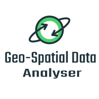

# Geo-Spatial Data Analyser

A Django based spacial data analysing project that deals with curating Geodata as geojson polygons for all the world's
countries, being updated in real-time and querying geo-spacial data.

[![Contributors][contributors-shield]][contributors-url]
[![Issues][issues-shield]][issues-url]
[![MIT License][license-shield]][license-url]
[![LinkedIn][linkedin-shield]][linkedin-url]

<!-- PROJECT LOGO -->
<br />
<div align="center">
  <a href="https://github.com/apankit2490/spatial-data-analyser">
    
  </a>
  <h3 align="center">Geo-Spatial Data Analyser
</h3>

  <p align="center">
    An awesome Geo-spatial Data Querying Tool!
    <br />
    <a href="https://github.com/apankit2490/spatial-data-analyser"><strong>Explore the docs »</strong></a>
    <br />
    <br />
    <a href="https://github.com/apankit2490/spatial-data-analyser/issues">Report Bug</a>
    ·
    <a href="https://github.com/apankit2490/spatial-data-analyser/issues">Request Feature</a>
  </p>
</div>

<!-- ABOUT THE PROJECT -->

## About The Project

![Django Admin View][product-screenshot-1]
![Django Admin Detailed View][product-screenshot-2]

This Project enables you to download, query and visualize World Geo-spatial data. It auto-updates its database every 10
minutes(configurable) to pull the latest World GeoJson data and updates the database. The updates are a background job,
that doesn't affect the real-time traffic.

Features:

* Obtains real-time geographical data from https://datahub.io
* Most efficient and powerful geo-libraries and tools are used to query and obtain data in no-time!
* Application is thoroughly covered with tests, ensuring best quality of the product.
* Complete application along with its all dependant services are power-packed and containerized, enabling you to
  kick-off in a flash!

## Tech-Stack

* [Python3](https://www.python.org/downloads/)
* [Django](https://www.djangoproject.com/)
* [Django-Rest-FrameWork](https://www.django-rest-framework.org/)
* [PostGIS](https://postgis.net/)
* [Redis](https://redis.io/)
* [RabbitMQ](https://www.rabbitmq.com/)
* [Leaflet.js](https://leafletjs.com/)
* [Docker](https://www.docker.com/)
* [VirtualEnv](https://pypi.org/project/virtualenv/)

<p align="right">(<a href="#top">back to top</a>)</p>

<!-- GETTING STARTED -->

## Getting Started

To get Dev-Started with this Project, clone the repo and:

#### Install Prerequisites

- [Python3.7+](https://www.python.org/downloads/)
- [VirtualEnv](https://virtualenv.pypa.io/en/latest/)
- [postgresql13.0+](https://www.postgresql.org/docs/10/release-10-6.html)
- **python-psycopg2** `sudo apt-get install python-psycopg2`
- **libpq-dev** `sudo apt-get install libpq-dev`

#### Python 3.7+

Install/Upgrade to Python3.7+ and make it as default

#### Database[PostGIS]

`CREATE DATABASE spatial_database;`

`CREATE USER pixxel WITH PASSWORD '4zZ3Cb&V96!ZX9fu';`

`GRANT ALL PRIVILEGES ON DATABASE spatial_database to pixxel;`

### Initialize the project

```
python3 -m venv venv
source venv/bin/activate
```

Install dependencies

```
pip3 install -r requirements.txt
```

Migrate and run the server

```
python manage.py migrate
python manage.py runserver
```

## Environment Variables

To run this project, please add the following environment variables to your .env file

`DATABASE_URL`

`SECRET_KEY`

`ALLOWED_HOSTS`

`DATAHUB_GEOJSON_URL`

`LOG_LEVEL`

## Running Test Cases

```
python manage.py test
```

## Docker-Run the Application!

This is application is absolutely designed to run on docker environment, pre-equipped with all necessary libraries and
services(docker-compose), enable you fire it up on-the-go!

### Building the image

#### Self build using Repository checkout

To build the image from source, do:

```shell
docker build -t ankitpatnaik/spatial-data-analyser git://github.com/apankit2490/spatial-data-analyser
```

Alternatively clone the repository and build against any preferred branch

```shell
git clone git://github.com/apankit2490/spatial-data-analyser
git checkout branch_name
```

Then do:

```shell
docker build -t ankitpatnaik/spatial-data-analyser .
```

### Running the container

To create a running container do:

```shell
docker run --name "spatial_data_analyser" -p 8000:8000 -d -t ankitpatnaik/spatial-data-analyser
```

## Convenience docker-compose

For convenience, a ``docker-compose.yml`` is designed to run the whole application along with its dependent services *(
redis, postgis, etc...)* with no pre-configuration needed on the host machine.

The docker compose recipe will expose application on port 8000.

The docker-compose is so designed to run the django tests and fire-up all services only if they are successful.

```shell
docker-compose up --abort-on-container-exit 
```

<!-- CONTACT -->

## Contact

Ankit Kumar Patnaik - [@ankit-kumar-patnaik](https://linkedin.com/in/ankit-kumar-patnaik/) - apankit240@gmail.com

Project
Link: [https://github.com/apankit2490/spatial-data-analyser](https://github.com/apankit2490/spatial-data-analyser)

<p align="right">(<a href="#top">back to top</a>)</p>


[contributors-shield]: https://img.shields.io/badge/CONTRIBUTORS-1-brightgreen?style=for-the-badge

[contributors-url]: https://github.com/apankit2490/spatial-data-analyser/graphs/contributors

[issues-shield]: https://img.shields.io/github/issues/othneildrew/Best-README-Template.svg?style=for-the-badge

[issues-url]: https://github.com/othneildrew/Best-README-Template/issues

[license-shield]: https://img.shields.io/github/license/othneildrew/Best-README-Template.svg?style=for-the-badge

[license-url]: https://github.com/othneildrew/Best-README-Template/blob/master/LICENSE.txt

[linkedin-shield]: https://img.shields.io/badge/-LinkedIn-black.svg?style=for-the-badge&logo=linkedin&colorB=555

[linkedin-url]: https://linkedin.com/in/ankit-kumar-patnaik/

[product-screenshot-1]: static/images/screenshot_django_admin.png

[product-screenshot-2]: static/images/screenshot_dj_admin_detailed_view.png